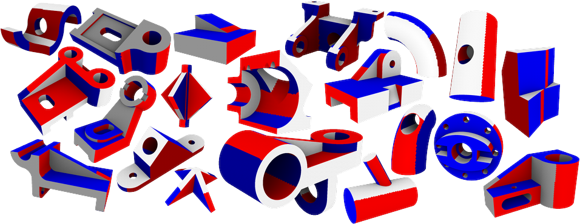
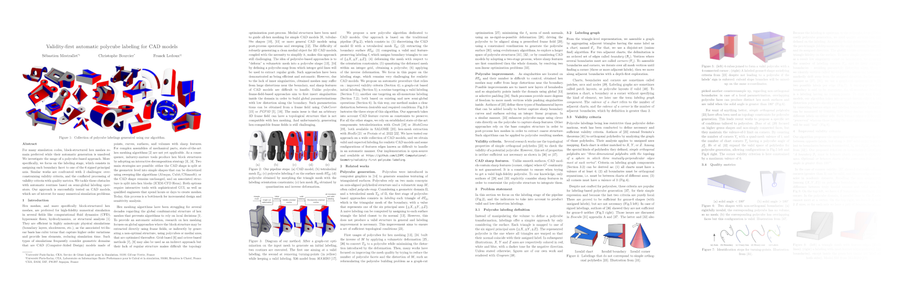

<div align="center">
    <h1>Validity-first automatic polycube<br/>labeling for CAD models</h1>
    <p>
        Sébastien Mestrallet <a href="https://orcid.org/0000-0002-4519-2814"></a>, Christophe Bourcier <a href="https://orcid.org/0000-0001-6171-024X"></a>, Franck Ledoux <a href="https://orcid.org/0000-0003-3469-3186"></a><br/>
        <em>SIAM International Meshing Roundtable Workshop 2025</em><br/>
        Reference implementation<br/>
        <a href="https://gist.github.com/cheerfulstoic/d107229326a01ff0f333a1d3476e068d"></a>
    </p>
    
</div>

## Abstract

For many simulation codes, block-structured hex meshes remain preferred while their automatic generation is unsolved.
We investigate the usage of a polycube-based approach.
More specifically, we focus on the labeling stage, which consists in assigning each boundary facet to one of the 6 signed principal axis.
Similar works are confronted with 2 challenges: over-constraining validity criteria, and the conflated processing of validity criteria with quality metrics.
We tackle these obstacles with automatic routines based on semi-global labeling operators.
Our approach is successfully tested on CAD models, which are of interest for many numerical simulation problems.

## Paper

We will link to the IMR 2025 proceedings.

Preprint: [arXiv:2502.05712](https://arxiv.org/abs/2502.05712)
<a href="https://arxiv.org/pdf/2502.05712">

</a>

## Requirements

- Linux-based OS
- gcc >= 11 (C++20)
- [CMake](https://cmake.org/) > 3.11
- [Geogram's other requirements](https://github.com/BrunoLevy/geogram/wiki/compiling_Linux#prerequisites), such as X11 development libraries

## Dependencies

 Name | License | Description | Inclusion
------|---------|-------------|-----------
[geogram](https://github.com/BrunoLevy/geogram) | [BSD-3-Clause](https://github.com/BrunoLevy/geogram/blob/main/LICENSE) | mesh data structure, I/O and GUI | git submodule
[Eigen](https://gitlab.com/libeigen/eigen/) | [Mozilla Public License 2.0](https://gitlab.com/libeigen/eigen/-/blob/master/COPYING.MPL2) | linear algebra, including JacobiSVD solver | [CPM.cmake](https://github.com/cpm-cmake/CPM.cmake) (CMake's FetchContent)
[fmt](https://github.com/fmtlib/fmt) | [MIT](https://github.com/fmtlib/fmt/blob/master/LICENSE) | modern string formatting | git submodule
[dbg-macro](https://github.com/sharkdp/dbg-macro) | [MIT](https://github.com/sharkdp/dbg-macro/blob/master/LICENSE) | the must-have dbg(...) macro to replace cout/printf-based debugging | git submodule
[nlohmann/json](https://github.com/nlohmann/json) | [MIT](https://github.com/nlohmann/json/blob/develop/LICENSE.MIT) | JSON for modern C++ | git submodule
[tinygltf](https://github.com/syoyo/tinygltf) | [MIT](https://github.com/syoyo/tinygltf/blob/release/LICENSE) | glTF 2.0 (the "JPEG of 3D") export | git submodule
[DisjointSet](https://www.nayuki.io/page/disjoint-set-data-structure) | [MIT](https://www.nayuki.io/page/disjoint-set-data-structure) | disjoint-set/union-find data structure, implementation by [Nayuki](https://www.nayuki.io/) | in the source code
[gco-v3.0](https://vision.cs.uwaterloo.ca/code/) | [**for research purposes only**, patented](ext/GraphCutOptimization/GCO_README.TXT) | multi-label energies optimization, implementation by Olga Veksler and Andrew Delong | in the source code

## How to build

```bash
git clone --recurse-submodules https://github.com/LIHPC-Computational-Geometry/validity-first-polycube-labeling.git
cd validity-first-polycube-labeling
```

Open `ext/geogram/src/lib/geogram/mesh/mesh_halfedges.h` and change accessibility of `MeshHalfedges` variables from `private` to `protected`.

```diff
         void move_to_opposite(Halfedge& H) const;
 
-    private:
+    protected:
         Mesh& mesh_;
         Attribute<index_t> facet_region_;
```

Then:

```bash
# from validity-first-polycube-labeling/
mkdir build_Release
cd build_Release
cmake .. -G Ninja -DCMAKE_BUILD_TYPE=Release
ninja
```

Remove `-G Ninja` to use [Make](https://www.gnu.org/software/make/) instead, if you don't have [Ninja](https://ninja-build.org/).

## File format

During development, we used :
- the MEDIT / Gamma mesh file (GMF) ASCII format (.mesh) for tetrahedral and hexahedral meshes
- the Wavefront OBJ (.obj) format for 3D triangle meshes

but, as Geogram-based code, [other formats can be used](https://github.com/BrunoLevy/geogram/wiki/Mesh#loading-and-saving-a-mesh).

The .obj surface of a tetrahedral mesh can be generated withe the `extract_surface` app.

Polycube labelings are stored in a separate file, in plain text (.txt), with as many lines as there are triangles in the input 3D triangle mesh. For each line there is an integer in [0:5] encoding {+X,-X,+Y,-Y,+Z,-Z}.

## Main algorithm : `automatic_polycube` app

It generates a polycube labeling `labeling.txt` from a 3D triangle mesh `surface.obj`.

```bash
# from validity-first-polycube-labeling/build_Release/
./bin/automatic_polycube ../data/B0/surface.obj output=../data/B0/labeling.txt gui=false
```


There is also a graphic user interface, to manually apply labeling operators :

```bash
# from validity-first-polycube-labeling/build_Release/
./bin/automatic_polycube ../data/B0/surface.obj gui=true
# or just
./bin/automatic_polycube
# then drag-and-drop a .obj in the 3D viewer
```

1. In the right panel, click on "Compute graph-cuts labeling" to generate de default initial labeling
1. If the labeling in invalid*, try the "Auto fix validity" button, which loop over manual operators whose button is just above
1. If not all boundaries are monotone*, try "Auto fix monotonicity", which loop over manual operators whose button is just above
1. In the menu bar, click on "File" > "Save as", choose a location and a filename, and select "txt" as extension to export the per-surface-triangle labeling.

*Not the case with the provided B0 model.

## Visualize an existing labeling

You can use the `labeling_viewer` app, which is the base of the `automatic_polycube` one and does not contain labeling modification buttons.

```bash
# from validity-first-polycube-labeling/build_Release/
./bin/labeling_viewer ../data/B0/surface.obj ../data/B0/labeling.txt
# or just
./bin/labeling_viewer
# then drag-and-drop a .obj then a .txt in the 3D viewer
```

You can also export a `.geogram` mesh, with the polycube labeling as embedded attribute, and open it with [Graphite](https://github.com/brunolevy/GraphiteThree).

```bash
# from validity-first-polycube-labeling/build_Release/
./bin/labeling_viewer ../data/B0/surface.obj ../data/B0/labeling.txt ../data/B0/output_labeled_surface.geogram
```

## Generate a hexahedral mesh from a given labeling

See
- [polycube_withHexEx](https://github.com/fprotais/polycube_withHexEx) : simple polycube parametrization, then calls [libHexEx](https://gitlab.vci.rwth-aachen.de:9000/HexEx/libHexEx) for the quantization ([Lyon et al. 2016](http://dx.doi.org/10.1145/2897824.2925976))
- [robustPolycube](https://github.com/fprotais/robustPolycube) : robust quantization ([Protais et al. 2022](https://doi.org/10.1016/j.cad.2022.103321))

You may need to use our `volume_labeling` app first to export a per-tetrahedron-facet labeling.

## How to cite our work

> S. Mestrallet, C. Bourcier, and F. Ledoux, "Validity-first automatic polycube labeling for CAD models", _Proceedings of the 2025 International Meshing Roundtable_, SIAM, March 2025, arXiv:[2502.05712](https://arxiv.org/abs/2502.05712) [cs.CG]

<details>
<summary>BibTeX</summary>

```bibtex
@inproceedings{mestrallet2025,
    title      = {Validity-first automatic polycube labeling for CAD models},
    author     = {Mestrallet, S{\'e}bastien and Bourcier, Christophe and Ledoux, Franck},
    year       = {2025},
    month      = {March},
    url        = {https://github.com/LIHPC-Computational-Geometry/validity-first-polycube-labeling},
    booktitle  = {International Meshing Roundtable},
    publisher  = {SIAM}
    eprinttype = {arxiv},
    eprint     = {2502.05712},
}
```

</details>

<details>
<summary><a href="https://github.com/typst/hayagriva/blob/main/docs/file-format.md">Hayagriva</a> (for <a href="https://typst.app/">Typst</a>)</summary>

```yaml
mestrallet2025:
    title: Validity-first automatic polycube labeling for CAD models
    author: ["Mestrallet, Sébastien", "Bourcier, Christophe", "Ledoux, Franck"]
    type: article
    date: 2025-03
    url: https://github.com/LIHPC-Computational-Geometry/validity-first-polycube-labeling
    serial-number:
        arxiv: "2502.05712"
    parent:
    - type: proceedings
      title: International Meshing Roundtable
      publisher: SIAM
```

</details>